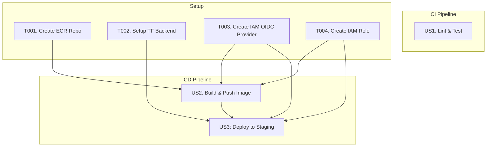

# タスクリスト: GitHub Actions を用いた CI/CD 基盤の構築

**ブランチ**: `003-github-actions-cicd`
**仕様**: `specs/003-github-actions-cicd/spec.md`

このドキュメントは、CI/CD基盤を構築するための実行可能なタスクを定義します。

## 実装戦略

MVP（Minimum Viable Product）として、まずユーザーストーリー1（CIワークフロー）を完了させ、コード品質の自動チェックを実現します。その後、ユーザーストーリー2（ビルド＆プッシュ）、ユーザーストーリー3（デプロイ）へと段階的にパイプラインを拡張していきます。各ユーザーストーリーは独立してテスト可能です。

---

## フェーズ 1: セットアップと前提条件

このフェーズでは、CI/CDパイプラインを構築するための基本的な設定を行います。

- [ ] T001 AWS ECR (Elastic Container Registry) リポジトリをTerraformで作成する `terraform/ecr.tf`
- [ ] T002 Terraformのstate管理用にS3バックエンドを設定する `terraform/main.tf`
- [ ] T003 GitHub ActionsとAWSを連携させるためのIAM OIDCプロバイダをTerraformで作成する `terraform/iam.tf`
- [ ] T004 GitHub ActionsのワークフローがECRへのプッシュやECSへのデプロイ権限を持つIAM RoleをTerraformで作成する `terraform/iam.tf`

---

## フェーズ 2: ユーザーストーリー 1 - コード品質の自動チェック (CI)

**ゴール**: featureブランチへのpushをトリガーに、lintとtestを自動実行する。
**独立テスト**: `git push`後、GitHub Actions上でlintとtestが実行され、結果がGitHub上で確認できること。

- [ ] T005 [US1] CIワークフローの基本構造を作成する `.github/workflows/ci.yml`
- [ ] T006 [P] [US1] Pythonコードのlintチェックを行うジョブを追加する `.github/workflows/ci.yml`
- [ ] T007 [P] [US1] Pytestを用いた単体テストを実行するジョブを追加する `.github/workflows/ci.yml`

---

## フェーズ 3: ユーザーストーリー 2 - コンテナイメージのビルドとプッシュ (CD)

**ゴール**: `main`ブランチへのマージをトリガーに、DockerイメージをビルドしECRにプッシュする。
**独立テスト**: `main`ブランチへのマージ後、新しいタグが付与されたコンテナイメージがECRリポジトリに存在すること。

- [ ] T008 [US2] CDワークフローの基本構造を作成する `.github/workflows/cd.yml`
- [ ] T009 [US2] OIDCを利用してAWS認証を設定し、IAM Roleを引き受けるステップを追加する `.github/workflows/cd.yml`
- [ ] T010 [US2] AWS ECRへのログイン処理を追加する `.github/workflows/cd.yml`
- [ ] T011 [US2] Dockerイメージをビルドし、コミットハッシュでタグ付けしてECRにプッシュするジョブを追加する `.github/workflows/cd.yml`

---

## フェーズ 4: ユーザーストーリー 3 - ステージング環境への自動デプロイ (CD)

**ゴール**: 新しいイメージがECRにプッシュされた後、ステージング環境へ自動デプロイする。
**独立テスト**: デプロイ後、ステージング環境のアプリケーションが新しいイメージで動作していること。

- [ ] T012 [US3] OIDCによるAWS認証を利用してTerraformのセットアップと実行を行うジョブをCDワークフローに追加する `.github/workflows/cd.yml`
- [ ] T013 [US3] イメージのビルド＆プッシュジョブが完了した後にデプロイジョブが実行されるように依存関係を設定する `.github/workflows/cd.yml`
- [ ] T014 [US3] 新しいDockerイメージのタグをTerraformの変数として渡し、ECSサービスを更新するように設定する `terraform/ecs.tf`

---

## フェーズ 5: ポリッシュとドキュメント

- [ ] T015 README.mdにCI/CDパイプラインの概要とOIDC設定について追記する `README.md`
- [ ] T016 [P] README.mdにGitHub Actionsのステータスバッジを追加する `README.md`

---

## 依存関係

-   **ユーザーストーリー 1** は独立しています。
-   **ユーザーストーリー 2** は **ユーザーストーリー 1** には依存しませんが、CDパイプラインの最初のステップです。
-   **ユーザーストーリー 3** は **ユーザーストーリー 2** の完了に依存します（イメージがECRに存在する必要があるため）。

## 並列実行の例

-   **ユーザーストーリー 1 内**:
    -   `T006` (lint) と `T007` (test) は、それぞれ別のジョブとして並列に実行可能です。
-   **ユーザーストーリー 2 と 3**:
    -   これらはCDパイプラインの一部であり、`T011` (build) が完了した後に `T012` (deploy) が実行されるため、本質的にシーケンシャルです。
-   **全体**:
    -   CIパイプライン (US1) とCDパイプライン (US2, US3) は異なるトリガー（featureブランチへのpush vs mainへのマージ）で実行されるため、互いに独立して動作します。
